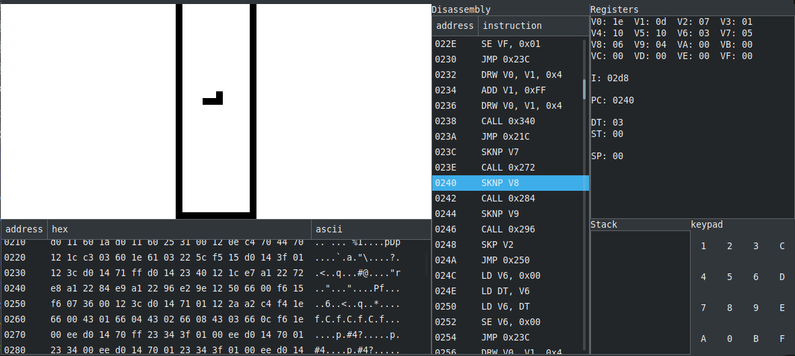
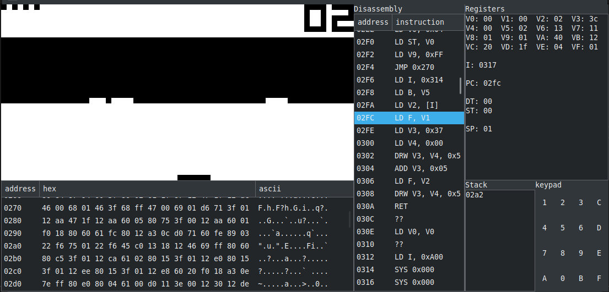

# CHIP-8

This is an interpreter implementation for [CHIP-8][chip8-wiki] by me as a fun side project, and to get beginning with building emulators and other fun stuff.

This is built using [rust][rust-site], and [gtk][gtk-site] for gui.

### Components
This emulator is full as the documentation, and that include:
- 32x64 screen
- Keyboard support
- Sounds
- Debugger (on the way).

#### CPU

The main part is the CPU and its where users interface with the emulator,
users can run *roms* by making the CPU read the file containing the
*rom* data:

``` rust
let mut cpu = CPU::new();
cpu.read_file(&mut File::open("/path/to/rom.ch8").unwrap());

cpu.run_display_application();
```

#### Keyboard
Chip-8's has 16 keys in its keypad as shown:


| 1 | 2 | 3 | C |
|---|---|---|---|
| 4 | 5 | 6 | D |
| 7 | 8 | 9 | E |
| A | 0 | B | F |

This emulator uses the left side of the keyboard as a keypad as shown:

| 1 | 2 | 3 | 4 |
|---|---|---|---|
| Q | W | E | R |
| A | S | D | F |
| Z | X | C | V |

#### Sound
I used a sin wave sound signal of `300Hz` frequency. 

### Screenshots
Some games and roms tried with this emulator

> Note: Thanks to dmatlack for his great collection of roms, can be found in [dmatlack's chip8 repo][dmatlack's chip8 repo]

#### Bricks

<br>
<br>


#### Space Invaders


#### Ping Pong


#### Maze


#### Keypad tester


### Debugger
On the process of making a debugger for this emulator/interpreter.

The user can pause the CPU with the `<SPACE>` key, and unpause with the same key.
And during debug, users can use the `<N>` key to advance one instruction at a time. (can be held).

These can be changed in [cpu.rs::setup_keyboard](src/system/cpu.rs).

#### TODO:
- [x] Show registers
- [x] Show stack
- [x] Show memory
- [x] Show instructions
- [x] Show keypad
- [x] Allow user to stop the CPU in the middle
- [ ] Allow user to edit registers
- [ ] Allow user to edit memory
- [ ] Show which registers have changed during the last
  instruction (coloring or something).
- [ ] Implement flow-oriented disassembly (Some roms, have instructions on odd addresses, like Space Invaders).
- [ ] Breakpoints on instructions
- [ ] Breakpoints on data


<br>
<br>



Any suggestions and edits are welcomed in the issues and pull requests.

[chip8-wiki]: https://en.wikipedia.org/wiki/CHIP-8
[rust-site]: https://www.rust-lang.org/
[gtk-site]: https://www.gtk.org/
[dmatlack's chip8 repo]: https://github.com/dmatlack/chip8
